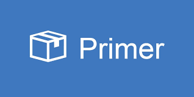
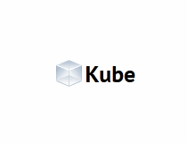
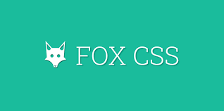

# Click on the topics name For Learning
-----------------------------------------
# Frontend Development
1/[HTML5](#HTML5)  

2/[CSS3](#CSS3)   

3/[BOOTSTRAP](#BOOTSTRAP)   

4/[SASS](#SASS) 

5/[TAILWIND-CSS](#TAILWIND_CSS) 

6/[Materialize](#Materialize) 

7/[Material Design Lite](#Material_Design_Lite) 

8/[Bulma](#Bulma) 

9/[Foundation](#Foundation)

10/[Skeleton](#Skeleton)

11/[Semantic_UI](#Semantic_UI)

12/[Pure_CSS](#Pure_CSS) 

13/[UI_Kit](#UI_Kit) 

14/[Milligram](#Milligram) 

15/[Primer](#Primer)

16/[Spectre](#Spectre)

17/[Susy](#Susy)

18/[Tacit](#Tacit)

19/[Mini_CSS](#Mini_CSS) 

20/[Min_CSS](#Min_CSS)

21/[Blaze_CSS](#Blaze_CSS)

22/[Kube](#Kube)

23/[Furtive](#Furtive)

24/[Fox_CSS](#Fox_CSS)

# Learn Web Development

https://www.w3.org/

https://www.w3schools.com/whatis/

https://www.geeksforgeeks.org/web-development/

https://developer.mozilla.org/en-US/docs/Learn

https://www.codecademy.com/learn/paths/web-development

https://careerfoundry.com/en/tutorials/web-development-for-beginners/introduction-to-web-development/

https://www.tutorialspoint.com/website_development/index.htm

# Frontend Web Tools 📏 ⚙️ 📐 

# HTML5

https://www.w3schools.com/html/default.asp

https://htmldog.com/

https://devdocs.io/html/

https://developer.mozilla.org/en-US/docs/Web/HTML

https://html.spec.whatwg.org/multipage/

https://html.com/document/

https://webplatform.github.io/docs/html/

https://en.wikipedia.org/wiki/HTML

https://www.tutorialrepublic.com/html-tutorial/

https://www.web4college.com/html/index.php

https://www.quackit.com/html/

https://www.tagindex.net/html/

# CSS3
 

https://www.w3schools.com/css/default.asp

https://developer.mozilla.org/en-US/docs/Web/CSS

https://devdocs.io/css/

https://www.w3.org/Style/CSS/

https://webplatform.github.io/docs/css/

https://en.wikipedia.org/wiki/CSS

https://www.tutorialrepublic.com/css-tutorial/

https://www.web4college.com/css/

https://www.quackit.com/css/

https://www.tagindex.net/css/

https://rtlcss.com/

# BOOTSTRAP
 

https://getbootstrap.com/

https://www.w3schools.com/bootstrap/bootstrap_ver.asp

https://github.com/twbs/bootstrap

https://en.wikipedia.org/wiki/Bootstrap_(front-end_framework)

https://www.npmjs.com/package/bootstrap

https://bootstrapshuffle.com/

https://bootstrapshuffle.com/classes

https://devdocs.io/bootstrap~5/

# SASS
 

https://sass-lang.com/

https://www.w3schools.com/sass/sass_intro.php

https://en.wikipedia.org/wiki/Sass_(stylesheet_language)

https://getbootstrap.com/docs/5.1/customize/sass/

https://www.npmjs.com/package/sass

https://devdocs.io/sass/

https://sass-guidelin.es/

# TAILWIND_CSS

https://tailwindcss.com/

https://tailwindui.com/

https://dev.to/naveennamani/generate-offline-documentation-of-tailwindcss-in-5-minutes-3o79

https://www.npmjs.com/package/tailwindcss

https://nerdcave.com/tailwind-cheat-sheet

https://daisyui.com/

https://www.raycast.com/vimtor/tailwindcss

https://www.better.dev/quick-tailwind-introduction

https://www.jetbrains.com/help/webstorm/tailwind-css.html

https://packagecontrol.io/packages/Tailwind%20CSS%20Docs

https://tailwinduikit.com/docs

https://www.tailwindtoolbox.com/

https://openbase.com/js/tailwindcss/documentation#documentation

https://flowbite.com/docs/getting-started/introduction/

https://www.webiny.com/docs/how-to-guides/integrations/integrate-tailwindcss/

https://github.com/tailwindlabs/tailwindcss.com

# Materialize

https://materializecss.com/

https://www.um.es/docencia/barzana/materializecss/

https://github.com/Dogfalo/materialize

https://openbase.com/js/materialize-css/documentation

https://www.javatpoint.com/materialize-css-tutorial

https://www.codegrepper.com/search.php?answer_removed=1&q=materialize.css%20documentation%200.97.7

https://www.npmjs.com/package/materialize-css/v/0.97.6

https://www.geeksforgeeks.org/materialize-css/

https://www.tutorialspoint.com/materialize/materialize_tutorial.pdf

https://npmmirror.com/package/materialize-css

https://www.rubydoc.info/gems/materializecss

# Material_Design_Lite

https://getmdl.io/

https://www.wisdomjobs.com/e-university/material-design-lite-tutorial-1564.html 

https://www.sitepoint.com/practical-introduction-material-design-lite-google/

https://developers.google.com/web/updates/2015/08/material-design-lite-1-0-4-release

https://www.tutorialspoint.com/materialdesignlite/index.htm

https://material.io/develop/web/guides/migrating-from-mdl

https://github.com/google/material-design-lite

# Bulma

https://bulma.io/

https://bulma.io/documentation/

https://versions.bulma.io/0.7.4/

https://github.com/jgthms/bulma

https://www.gatsbyjs.com/docs/how-to/styling/bulma/

https://bulma.bootcss.com/documentation/

https://www.unpkg.com/browse/bulma@0.8.2/README.md

http://bulma.filippotoso.com/ 

# Foundation

https://get.foundation/sites/docs/

https://get.foundation/frameworks-docs.html

https://get.foundation/sites/docs-v5/

https://dracos.github.io/foundation-sites/

https://github.com/foundation/foundation-sites

https://github.com/foundation/foundation-docs

https://www.npmjs.com/package/foundation-sites

https://en.wikipedia.org/wiki/Foundation_(framework)

https://www.w3resource.com/zurb-foundation3/introduction.php

https://www.tutorialspoint.com/foundation/foundation_installation.htm

# Skeleton

http://getskeleton.com/

https://cdnjs.com/libraries/skeleton

https://www.w3schools.com/w3css/w3css_web_html.asp

https://openbase.com/js/skeleton-css

https://ieatcss.com/skeleton-tutorial.html

https://www.sitepoint.com/getting-started-with-skeleton-simple-css-boilerplate/

https://skeleton-elements.dev/core/

https://www.scribd.com/document/354677186/Getting-Started-With-Skeleton

https://framework7.io/docs/skeleton

# Semantic_UI

https://semantic-ui.com/

https://cdnjs.com/libraries/semantic-ui

https://github.com/Semantic-Org/Semantic-UI

https://www.npmjs.com/package/semantic-ui-react

https://www.freecodecamp.org/news/semantic-ui-guide/

https://www.geeksforgeeks.org/semantic-ui/

https://react.semantic-ui.com/

https://semantic-ui-docs-gatsby.netlify.app/introduction/getting-started

https://semantic-org.github.io/Semantic-UI-Ember/#/modules

https://html5hive.org/semantic-ui-tutorial/

https://www.npmjs.com/package/semantic-ui-react

https://openbase.com/js/semantic-ui/documentation

https://legacy.semantic-ui.com/project/development.html

# Pure_CSS

https://purecss.io/

https://openbase.com/js/purecss/documentation

https://www.tutorialspoint.com/purecss/index.htm

https://github.com/pure-css/pure

https://responsivedesign.is/resources/frameworks/pure-css/

https://www.javatpoint.com/what-is-pure-css

https://yarnpkg.com/package/purecss

# UI_Kit

https://getuikit.com/

https://developer.apple.com/documentation/uikit

https://demos.creative-tim.com/now-ui-kit/docs/1.0/getting-started/introduction.html

https://github.com/uikit/uikit-site

https://docs-minimals.vercel.app/introduction

https://graindashboard.com/documentation/

https://developer.atlassian.com/platform/forge/ui-kit/

https://devdocs.prestashop.com/1.7/development/uikit/

https://www.npmjs.com/package/@amityco/ui-kit

https://vr-uikit.epibyte.com.au/

https://www.invisionapp.com/defined/ui-kit

# Milligram

https://milligram.io/

https://github.com/milligram/milligram

https://www.npmjs.com/package/milligram

https://cssrepo.com/lib/milligram-milligram

https://cdnjs.com/libraries/milligram

https://www.rubydoc.info/gems/milligram/1.3.0.0

https://codepen.io/blossk/pen/VeWZwR

https://openbase.com/js/milligram-scss/documentation

# Primer

https://primer.style/css/

https://github.com/primer/css

https://developers.viber.com/bower_components/primer-css/

https://unpkg.com/browse/@primer/css@12.6.0-rc.29d94fc/table-object/README.md

https://openbase.com/js/@primer/css

https://yarnpkg.com/package/@primer/css

https://gitflic.ru/project/vault/primer-css

https://codesandbox.io/examples/package/@primer/css

https://cdnjs.com/libraries/Primer

# Spectre

https://picturepan2.github.io/spectre/

https://github.com/picturepan2/spectre

https://github.com/trilbymedia/spectre-scss

https://www.npmjs.com/package/spectre.css-js

https://cdnjs.com/libraries/spectre.css/0.4.5

https://livesino.net/dev/docs/getting-started.html

https://npm.io/package/spectre.css-stylus

https://tomcam.gitbooks.io/spectre/content/

# Susy

https://susy.readthedocs.io/

https://www.oddbird.net/susy/docs/

https://css-tricks.com/build-web-layouts-easily-susy/

https://readthedocs.org/projects/susychina/downloads/pdf/latest/

https://www.npmjs.com/package/susy

https://dev.mobify.com/v2.x/how-to-guides/categories/design/creating-responsive-layout-grids-with-susy

https://learnsusy.zellwk.com/

# Tacit

https://yegor256.github.io/tacit/

https://github.com/yegor256/tacit

https://www.npmjs.com/package/tacit-css

https://www.yegor256.com/2015/04/13/tacit-css-framework-for-dummies.html

https://snyk.io/advisor/npm-package/tacit-css

https://www.cssbed.com/tacit/

https://project-awesome.org/troxler/awesome-css-frameworks

https://www.reddit.com/r/programming/comments/32ianw/tacit_a_css_framework_without_classes/

# Mini_CSS

https://minicss.org/docs

https://developer.mozilla.org/en-US/docs/Web/CSS/min()

https://github.com/Chalarangelo/mini.css/

https://medium.com/hackernoon/designing-a-simple-web-page-with-mini-css-f455e9f6403b

https://webpack.js.org/plugins/mini-css-extract-plugin/

https://www.npmjs.com/package/mini-css-extract-plugin

https://cdnjs.com/libraries/mini.css/2.3.7

https://stackshare.io/mini-css

# Min_CSS

https://mincss.com/

https://github.com/owenversteeg/min

https://www.npmjs.com/package/@nib/css-framework

# Blaze_CSS

https://blazecss.com/

https://www.blazeui.com/

https://www.npmjs.com/package/@blaze/css

https://openbase.com/js/blaze/documentation

http://blazejs.org/

https://www.seekpng.com/ipng/u2w7t4w7o0r5t4i1_blaze-css-css-framework/

https://blaze.today/commands/site/

# Kube

https://kube7.imperavi.com/

https://github.com/imperavi/kube

https://plone-theming-suite.readthedocs.io/en/latest/templates_theme/diazo/diazoframework/kube_themes.html

https://rdrr.io/github/hrbrmstr/markdowntemplates/man/kube.html

https://rdoc.info/gems/kube

https://web-dev.umb.edu/kube-docs

https://openbase.com/js/kube-css

https://web-dev.umb.edu/kube-docs/get-started/

https://www.reddit.com/r/web_design/comments/11gxia/kube_cssframework_for_professional_developers/

https://www.bypeople.com/kube-css-framework/

https://saravanakumargn.github.io/css-frameworks-compare/kube/

http://cssframeworks.org/details/kube/

# Furtive

https://www.furtive.co/

https://github.com/johno/furtive

https://saravanakumargn.github.io/css-frameworks-compare/furtive/

https://www.npmjs.com/package/furtive/v/1.0.0

https://kandi.openweaver.com/css/johno/furtive

https://npm.io/package/furtive-code

https://unpkg.com/browse/furtive-flag-object@0.0.1/README.md

# Fox_CSS

https://fox-css.com/documents/

https://github.com/ronanlevesque/FOX-CSS

https://www.npmjs.com/package/fox-css

# OS(Operating System)  